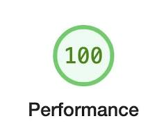
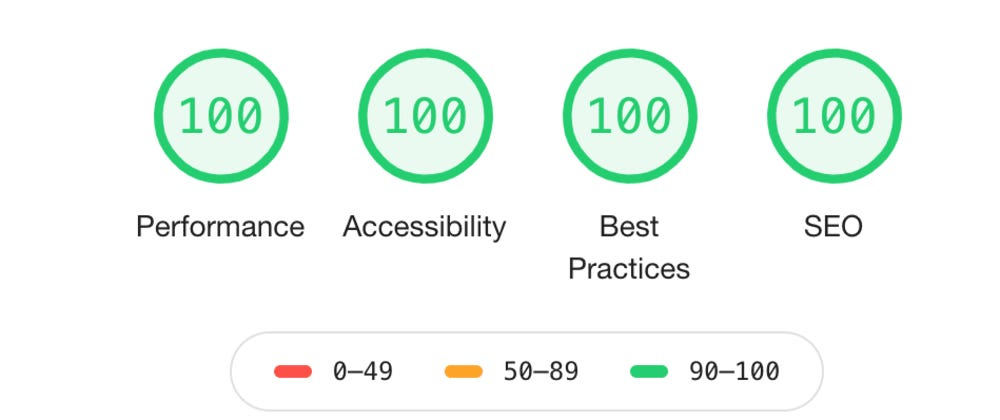

# AI Performance Guardrails 🛡️

[](https://opensource.org/licenses/MIT)
[](https://github.com/dansinger93/AI-Coding-with-Speed-Guardrails-)
[](https://github.com/dansinger93/AI-Coding-with-Speed-Guardrails-/releases)

<div align="center">
  
</div>

<div align="center">
  
</div>

**Stop your AI from pushing bloated, slow code to production.**

This is a complete performance verification system that forces AI coding assistants (Claude Code, Cursor, GitHub Copilot, etc.) to validate code against **three** critical measures:

1. **Synthetic Tests** — Lighthouse (100% performance required)
2. **Real User Data** — Google Analytics Core Web Vitals (must not regress)
3. **Search Health** — Google Search Console (rankings, crawl errors, indexing)

If any check fails, the AI automatically refactors its own code until it passes all three.

## Why use this?

✅ **Bulletproof Code** — AI validates against both test scores AND real user data
✅ **Zero Manual Setup** — One command installs everything (Lighthouse + GA + GSC)
✅ **Self-Healing** — AI reads performance errors and fixes them automatically
✅ **Graceful Degradation** — Works with just Lighthouse on day one, add GA/GSC later
✅ **Distribution Ready** — Curl these files into any project

---

## ⚡ Installation (with or without analytics)

### Option A: Lighthouse Only (Quickstart — 30 seconds)

Drop these files into your project:

```bash
# 1. Core files
curl -O https://raw.githubusercontent.com/YOUR_USERNAME/ai-performance-guardrails/main/CLAUDE.md
curl -O https://raw.githubusercontent.com/YOUR_USERNAME/ai-performance-guardrails/main/lighthouserc.js
mkdir -p scripts
curl -o scripts/check-speed.js https://raw.githubusercontent.com/YOUR_USERNAME/ai-performance-guardrails/main/scripts/check-speed.js

# 2. Install Lighthouse
npm install -D @lhci/cli
```

Then add to `package.json`:

```json
{
  "scripts": {
    "check-speed": "node scripts/check-speed.js"
  }
}
```

**Done.** Claude Code will load `CLAUDE.md` and enforce Lighthouse checks.

---

### Option B: Full Power (Lighthouse + GA + GSC — 5 minutes)

**First time setting up Google Cloud credentials?**
→ [Follow the credential setup guide](./GOOGLE_CLOUD_SETUP.md) (walks through everything step-by-step)

**Already have credentials?**
1. **Grab the setup script:**

```bash
curl -o setup.sh https://raw.githubusercontent.com/YOUR_USERNAME/ai-performance-guardrails/main/setup.sh
bash setup.sh
```

The script will:
- Ask for your GA Property ID and GSC Site URL
- Prompt for your Google Cloud service account JSON file path
- Install MCP servers (analytics-mcp, mcp-server-gsc)
- Wire everything into Claude Code settings
- Run a smoke test

2. **Add these files to your project** (same as Option A):

```json
{
  "scripts": {
    "check-speed": "node scripts/check-speed.js"
  }
}
```

3. **Restart Claude Code** so it loads the new MCP servers

**Done.** The full 3-phase loop is now active.

---

## The Goal

Every code change is validated to achieve this:

```
┌─────────────┬──────────────┬─────────────┬────────┐
│  Performance│ Accessibility│  Best       │  SEO   │
│    100      │     100      │ Practices   │  100   │
│             │              │    100      │        │
└─────────────┴──────────────┴─────────────┴────────┘
```

Plus: **Real user metrics don't regress** (GA Core Web Vitals, GSC rankings)

---

## How It Works: The 3-Phase Loop

### Phase 1 — Establish Baseline (Before Writing Code)

```
node scripts/check-analytics.js baseline
```

The AI captures:
- 📊 Core Web Vitals (LCP, CLS, INP) from Google Analytics
- 📈 Top slowest pages by URL
- 🔍 Top search queries and CTR from Google Search Console
- ⚠️ Any crawl errors or indexing failures

These metrics are saved to `.perf-baseline.json` — the bar the AI cannot regress below.

**If GA/GSC not configured**: Phase 1 is skipped silently. Lighthouse still runs.

### Phase 2 — Write Code & Enforce Lighthouse (The Loop)

```
npm run check-speed  (repeats until 100%)
```

1. **You ask Claude Code to add/update code**
2. **Claude builds and runs Lighthouse**
3. **Results:**
   - ✅ **100%?** Proceed to Phase 3
   - ❌ **Below 100%?** Claude reads the error, identifies the bottleneck (large bundles, unoptimized images, main thread blocking), refactors, and retries

This loop repeats until Lighthouse reports 100% performance.

### Phase 3 — Validate Against Real User Data (After Lighthouse Passes)

```
node scripts/check-analytics.js validate
```

The AI compares current metrics against the baseline from Phase 1:
- 📊 Did Core Web Vitals improve or hold steady?
- 🔍 Did search rankings or CTR drop?
- ⚠️ Are there new crawl errors?

**Results:**
- ✅ **Improved or stable?** Code is committed. Done.
- ❌ **Regression detected?** Claude must refactor before committing.

**If GA/GSC not configured**: Phase 3 is skipped silently. Code commits after Phase 2.

---

## What Gets Measured

| Service | Metrics | What It Catches |
|---------|---------|-----------------|
| **Lighthouse** | Performance, Accessibility, Best Practices, SEO | Bloated bundles, unoptimized images, render-blocking resources, CLS issues |
| **Google Analytics** | LCP, CLS, INP (Core Web Vitals) | Real user slowdowns that don't show in synthetic tests |
| **Search Console** | Rankings, CTR, impressions, crawl errors | SEO regressions, indexing problems, search visibility drops |

---

## Customization

### Change Lighthouse thresholds

Edit `lighthouserc.js`:

```javascript
'categories:performance': ['error', { minScore: 0.95 }],  // 95% instead of 100%
'categories:accessibility': ['warn', { minScore: 0.8 }],
```

### Change the build/start command

If you're not using Next.js, edit `scripts/check-speed.js`:

```javascript
execSync('yarn build', { stdio: 'inherit' });  // Your build command
execSync('yarn dev', { stdio: 'inherit' });    // Your dev server command
```

### Skip individual Lighthouse checks

In `lighthouserc.js`:

```javascript
'cumulative-layout-shift': ['off'],  // Don't enforce CLS
'first-contentful-paint': ['off'],   // Don't enforce FCP
```

---

## Troubleshooting

### Lighthouse errors

**"Cannot find module @lhci/cli"**
```bash
npm install -D @lhci/cli
```

**"Cannot connect to localhost:3000"**
- Ensure `npm run start` or `npm run dev` works for your project
- Update the start command in `scripts/check-speed.js`
- Or switch to testing your production URL directly (see below)

**"My Lighthouse score is 90+ locally but fails in CI / on the real site"**

Localhost and production can diverge by 10-30 points. The gap comes from:
- Production has CDN, Brotli compression, HTTP/2 — localhost does not
- Dev mode (`npm run dev`) ships unminified bundles that inflate TBT artificially
- Always run `npm run build && npm run start` (production mode), not `npm run dev`

To eliminate the gap entirely, point `lighthouserc.js` at your live production URL:
```js
collect: {
  numberOfRuns: 3,
  url: ['https://your-site.com'],
  // no startServerCommand needed
}
```
`check-speed.js` detects the https URL and skips the build step automatically.

**"Scores are inconsistent — pass one run, fail the next"**

Single-run Lighthouse scores swing ±10 points. Use `numberOfRuns: 3` in `lighthouserc.js`
(already the default in this repo). Never diagnose a score from a single run.

### Analytics setup issues

**"Service account file not found"**
- Download your service account JSON from Google Cloud Console
- Ensure the path in `.env.analytics` is absolute

**"GA authentication failed (401)"**
- Verify the service account email has "Analytics Viewer" role in GA
- Check your property ID matches GA4 (not Universal Analytics)

**"GSC authentication failed (403)"**
- Ensure the service account email is added as a "Property Administrator" in GSC
- Use the exact site URL (with https:// and trailing slash, or sc-domain: prefix)

**"Data is older than 28 days"**
- GA API requires at least 24 hours of data. If your site is new, Phase 1 may show minimal data initially.
- The tool still works — Phase 2 (Lighthouse) runs regardless.

### "My project is slow even after Lighthouse passes 100%"

This is rare but can happen if:
- Real user experience differs from synthetic test environment
- Your hosting/CDN has regional performance issues
- Third-party scripts (analytics, ads) are slower in production

Check `.perf-baseline.json` and the validate report to see which metric regressed, then focus your optimization there.

### "TBT is high even though I don't have large images or blocking scripts"

TBT is almost always caused by JavaScript running on the main thread. The most common
hidden source: **animation libraries (Framer Motion, GSAP, AOS) imported in shared
layout components** (Navbar, Header, Footer, Layout wrappers).

Because these components render on every page, their dependencies end up in the
critical-path shared chunk — loaded synchronously on every navigation.

Fix: replace JS animations in shared components with CSS keyframe animations or
Tailwind's `animate-in` utilities. See the CLAUDE.md Performance Playbook for details.

---

## Example Workflow

```
You: "Add a carousel with 50 product images"

Claude Code:
  ├─ Phase 1: node scripts/check-analytics.js baseline
  │  └─ Saves baseline: LCP=2.1s, CLS=0.08, 15 top queries recorded
  │
  ├─ Phase 2: npm run check-speed (loop)
  │  ├─ Writes carousel component with img tags
  │  ├─ Lighthouse: 34% (images unoptimized, 12MB bundle)
  │  ├─ Refactors: next/image, WebP, lazy loading
  │  ├─ Lighthouse: 87% (still has unused JS)
  │  ├─ Removes dead code, code-splits routes
  │  ├─ Lighthouse: 100% ✓
  │
  └─ Phase 3: node scripts/check-analytics.js validate
     ├─ Current: LCP=1.9s, CLS=0.05 (IMPROVED ✓)
     ├─ Queries: same 15, CTR stable (GOOD ✓)
     └─ Code committed
```

---

## Contributing

Found a bug? Have a feature idea? Submit a PR!

We welcome contributions for:
- Framework-specific optimizations (Vue, Svelte, etc.)
- CI/CD examples (GitHub Actions, GitLab, Vercel, etc.)
- Extended analytics support (Plausible, Fathom, Mixpanel)
- Additional validators (WebPageTest, SpeedCurve)

---

## License

MIT — Use freely in your projects.

---

*Built to keep the web fast.* ⚡
